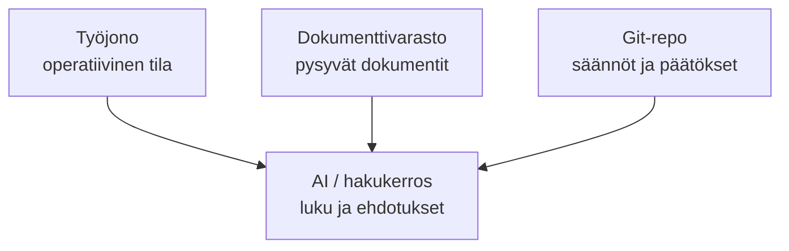

[English](README.md) | [Suomi](README.fi.md)

# Hallittu tietopohja — portfoliodemo

Tämä on itsenäinen, synteettisellä aineistolla rakennettu portfoliohanke. Se näyttää,
miten pieni organisaatio voi hallita dokumentoitua toimintamallia versionhallinnassa
ilman asiakasdataa, henkilötietoja tai tuotantojärjestelmäkytkentöjä.

> **Clean-room-demo:** projekti ei ole asiakas- tai työnantajarepon kopio, forkki tai
> julkaisu. Kaikki nimet, aineisto, tunnisteet ja esimerkit on luotu tätä demoa varten.

## Mitä tämä osoittaa

- järjestelmien vastuurajojen ja Source of Truth -roolien määrittely
- päätösten dokumentointi ADR-muodossa
- AI:n käyttö analyysi- ja ehdotuskerroksena
- turvallinen handover/runbook-rakenne
- synteettisen testiaineiston käyttö
- metadata-, rakenne- ja salaisuustarkistukset Pythonilla
- automaattinen validointi GitHub Actionsissa

## Arkkitehtuurin periaate



Jokaisella tiedolla on yksi auktoritatiivinen koti. AI- tai hakukerros voi lukea
hyväksyttyjä lähteitä, mutta se ei muutu niiden masteriksi.

## Rakenne

```text
docs/
  architecture/       järjestelmärajat ja ingressimalli
  decisions/          ADR-päätökset
  governance/         AI- ja muutoksenhallinnan säännöt
  handover/           käyttö- ja palautusohje
examples/synthetic/   täysin keksitty testiaineisto
scripts/              validaattori
tests/                regressiotestit
```

## Kokeile paikallisesti

Vaatimus on Python 3.11 tai uudempi. Ulkoisia Python-riippuvuuksia ei tarvita.

```bash
python scripts/validate.py
python -m unittest discover -s tests -p 'test_*.py'
```

## Turvarajat

- Ei todellisia henkilöitä, asiakkaita, tikettejä, domaineja tai sisäisiä URL-osoitteita.
- Ei tunnuksia, tokeneita, salaisuuslinkkejä tai tuotannon konfiguraatiota.
- `examples/synthetic/` sisältää vain selvästi merkittyä keksittyä dataa.
- Integraatiot on kuvattu konseptitasolla; mitään ulkoista järjestelmää ei kutsuta.
- AI ei hyväksy, julkaise eikä muuta auktoritatiivista tietoa.

## Oma roolini tässä portfoliossa

Suunnittelin demonstraation tiedonhallinnan ja AI-avusteisen työn hallintamalliksi:
rajasin lähteiden vastuut, kuvasin päätöksenteon, rakensin tarkistettavan metadatamallin
sekä toteutin validaattorin, testit ja CI-portin. Tavoitteena oli tehdä hallintamallista
riittävän kevyt pienen organisaation arkeen ja samalla auditoitava.

## Julkaisutila

**Julkaistu auditoituna julkisena portfoliorepona.** Kyseessä on demonstraatio, ei
tuotantojärjestelmä eikä auktoritatiivinen toimintamalli. Tekninen ja sisällöllinen
auditointi sekä repon omistajan julkaisupäätös valmistuivat 13.9.2026; katso
[`AUDIT_2026-09-13.md`](AUDIT_2026-09-13.md) ja
[`PORTFOLIO_REVIEW.md`](PORTFOLIO_REVIEW.md). Julkinen näkyvyys varmistettiin
GitHubista julkaisun jälkeen. Työnantajan tai muun kolmannen osapuolen hyväksyntää ei
väitetä saaduksi.
