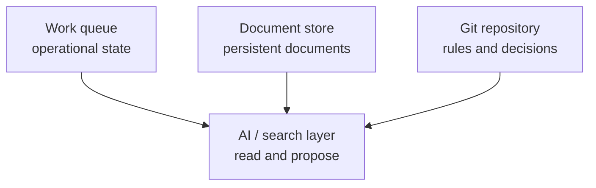

[English](README.md) | [Suomi](README.fi.md)

# Governed Knowledge Base — Portfolio Demo

This independently designed clean-room portfolio project demonstrates how a small
organization can manage an operational model in version control without customer data,
personal data or production-system integrations.

> **Clean-room demo:** This project is not a copy, fork or publication of a customer or
> employer repository. All names, data, identifiers and examples were created solely for
> this demonstration.

## What this demonstrates

- defining system boundaries and Source of Truth responsibilities
- documenting architectural decisions as ADRs
- using AI as an analysis and proposal layer
- creating a safe handover and runbook structure
- using synthetic test data
- validating metadata, structure and secret patterns with Python
- enforcing automated checks with GitHub Actions

## Architecture principle



Each type of information has one authoritative home. An AI or search layer may read
approved sources, but it does not become their master.

## Repository structure

```text
docs/
  architecture/       system boundaries and ingress model
  decisions/          architecture decision records
  governance/         AI and change-management rules
  handover/           operating and recovery instructions
examples/synthetic/   fully fictional test data
scripts/              validator
tests/                regression tests
```

## Run locally

Python 3.11 or newer is required. The project has no external Python dependencies.

```bash
python scripts/validate.py
python -m unittest discover -s tests -p 'test_*.py'
```

## Safety boundaries

- No real people, customers, tickets, domains or internal URLs.
- No credentials, tokens, secret-sharing links or production configuration.
- `examples/synthetic/` contains only clearly identified fictional data.
- Integrations are described at the conceptual level; no external system is called.
- AI does not approve, publish or modify authoritative information.

## My role in this portfolio project

I designed this demonstration as a governance model for operational knowledge and
AI-assisted work. I defined source responsibilities and decision boundaries, created a
reviewable metadata model, and implemented the validator, regression tests and CI gate.
The goal was to keep the model lightweight enough for a small organization while
preserving traceability and auditability.

## Publication status

**Published as an audited public portfolio repository.** This is a demonstration project,
not a production system or an authoritative operating model. The technical and content
audit and the repository owner's publication decision were completed on 2026-09-13; see
[`AUDIT_2026-09-13.md`](AUDIT_2026-09-13.md) and
[`PORTFOLIO_REVIEW.md`](PORTFOLIO_REVIEW.md). Public visibility was verified through
GitHub after publication. No employer or third-party approval is claimed.
